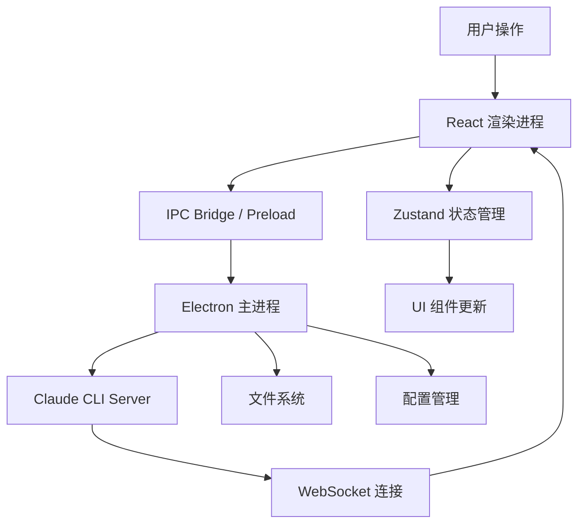

# 🚀 Claude IDE 升级建议

> 基于项目深度分析，整理的可升级和改进方向，涵盖性能、功能、安全、开发体验等多个维度。

---

## 📋 目录

1. [依赖和构建优化](#1-依赖和构建优化)
2. [性能优化](#2-性能优化)
3. [功能增强](#3-功能增强)
4. [UI/UX 改进](#4-uiux-改进)
5. [安全性增强](#5-安全性增强)
6. [开发体验改进](#6-开发体验改进)
7. [新 AI 功能](#7-新-ai-功能)
8. [数据持久化](#8-数据持久化)
9. [CI/CD](#9-cicd)
10. [文档改进](#10-文档改进)
11. [优先级总览](#优先级总览)

---

## 1. 依赖和构建优化

### 1.1 清理无用依赖

当前 `npm list` 显示大量 `extraneous` 包，需要清理：

```bash
npm prune
```

### 1.2 主进程迁移到 TypeScript

**当前状态**：`src/main/` 和 `src/preload/` 使用 JavaScript  
**建议**：迁移到 TypeScript 以获得类型安全

新增 `tsconfig.main.json`：

```json
{
  "extends": "./tsconfig.json",
  "compilerOptions": {
    "module": "CommonJS",
    "outDir": "./dist-main",
    "target": "ES2020"
  },
  "include": ["src/main/**/*", "src/preload/**/*"]
}
```

---

## 2. 性能优化

### 2.1 消息列表虚拟滚动

**问题**：长对话时大量 DOM 节点导致性能下降  
**解决方案**：使用 `react-virtuoso`

```bash
npm install react-virtuoso
```

```tsx
import { Virtuoso } from 'react-virtuoso'

// 在 Chat.tsx 中替换现有消息列表
<Virtuoso
  data={messages}
  itemContent={(index, msg) => <Message key={msg.id} msg={msg} />}
  followOutput="smooth"
/>
```

### 2.2 文件树懒加载

**问题**：大型项目文件树展开时可能卡顿  
**解决方案**：只渲染可见节点，子目录按需加载

```tsx
// 按需加载子目录，点击时再读取
const [loadedDirs, setLoadedDirs] = useState<Set<string>>(new Set())

const handleExpand = async (path: string) => {
  if (!loadedDirs.has(path)) {
    const entries = await api.fs.readDir(path)
    setLoadedDirs(prev => new Set(prev).add(path))
  }
}
```

### 2.3 Monaco 编辑器性能选项

```typescript
options={{
  // 在现有选项基础上追加
  largeFileOptimizations: true,
  // 超大文件关闭高开销功能
  codeLens: !isLargeFile,
  folding: !isLargeFile,
}}
```

---

## 3. 功能增强

### 3.1 集成终端

**实现方案**：使用 `node-pty` + `xterm.js`

```bash
npm install xterm xterm-addon-fit
npm install -D node-pty
```

渲染进程 `TerminalPanel.tsx`：

```tsx
import { Terminal } from 'xterm'
import { FitAddon } from 'xterm-addon-fit'

function TerminalPanel() {
  const termRef = useRef<HTMLDivElement>(null)

  useEffect(() => {
    const term = new Terminal({ theme: { background: '#1e1e2e' } })
    const fitAddon = new FitAddon()
    term.loadAddon(fitAddon)
    term.open(termRef.current!)
    fitAddon.fit()

    const api = (window as any).electronAPI
    api.terminal.create().then((id: string) => {
      term.onData(data => api.terminal.write(id, data))
      api.terminal.onData(id, (data: string) => term.write(data))
    })
  }, [])

  return <div ref={termRef} style={{ height: '100%' }} />
}
```

主进程新增 IPC：

```javascript
const pty = require('node-pty')
const os = require('os')

ipcMain.handle('terminal:create', async () => {
  const shell = os.platform() === 'win32' ? 'powershell.exe' : 'bash'
  const ptyProcess = pty.spawn(shell, [], {
    name: 'xterm-256color',
    cwd: workDir,
    env: process.env,
  })
  // 转发数据流到渲染进程
  ptyProcess.onData(data => mainWindow.webContents.send('terminal:data', data))
  return { success: true }
})

ipcMain.handle('terminal:write', (_, data) => {
  ptyProcess.write(data)
})
```

### 3.2 Git 集成

**实现方案**：使用 `simple-git`

```bash
npm install simple-git
```

```typescript
// src/renderer/components/Git/GitPanel.tsx
interface GitStatus {
  branch: string
  ahead: number
  behind: number
  staged: string[]
  modified: string[]
  untracked: string[]
}

function GitPanel() {
  const [status, setStatus] = useState<GitStatus | null>(null)

  useEffect(() => {
    const api = (window as any).electronAPI
    api.git.status(rootPath).then(setStatus)
  }, [rootPath])

  return (
    <div>
      <div>分支: {status?.branch}</div>
      <div>已暂存: {status?.staged.length} 个文件</div>
      <div>已修改: {status?.modified.length} 个文件</div>
      {/* Git 操作按钮 */}
    </div>
  )
}
```

在文件树中显示 Git 状态图标（M / A / U 等）。

### 3.3 完善搜索功能

**当前**：搜索面板仅为占位符  
**建议**：实现完整的全局搜索

```tsx
// src/renderer/components/Search/SearchPanel.tsx
function SearchPanel() {
  const [query, setQuery] = useState('')
  const [filePattern, setFilePattern] = useState('')
  const [caseSensitive, setCaseSensitive] = useState(false)
  const [results, setResults] = useState<SearchResult[]>([])
  const [loading, setLoading] = useState(false)

  const handleSearch = useCallback(async () => {
    if (!query.trim()) return
    setLoading(true)
    const api = (window as any).electronAPI
    const res = await api.tool.grep({
      pattern: query,
      path: rootPath,
      filePattern: filePattern || undefined,
    })
    setResults(parseGrepResults(res.results))
    setLoading(false)
  }, [query, filePattern, rootPath])

  return (
    <div className={styles.search}>
      <input
        placeholder="搜索内容..."
        value={query}
        onChange={e => setQuery(e.target.value)}
        onKeyDown={e => e.key === 'Enter' && handleSearch()}
      />
      <input placeholder="文件过滤 (*.ts)" value={filePattern} onChange={e => setFilePattern(e.target.value)} />
      <label>
        <input type="checkbox" checked={caseSensitive} onChange={e => setCaseSensitive(e.target.checked)} />
        区分大小写
      </label>
      {loading && <div>搜索中...</div>}
      {results.map(r => <SearchResultItem key={r.id} result={r} />)}
    </div>
  )
}
```

### 3.4 自动保存

```typescript
// 在 Editor.tsx 中添加防抖自动保存
useEffect(() => {
  if (!activeFile?.modified) return

  const timer = setTimeout(async () => {
    const api = (window as any).electronAPI
    if (!api) return
    const result = await api.fs.writeFile(activeFile.path, activeFile.content)
    if (result.success) {
      useFileStore.getState().markFileSaved(activeFile.path)
    }
  }, 3000) // 3 秒无操作后自动保存

  return () => clearTimeout(timer)
}, [activeFile?.content])
```

### 3.5 快速打开文件（Ctrl+P）

```tsx
// src/renderer/components/QuickOpen/QuickOpen.tsx
function QuickOpen({ isOpen, onClose }: Props) {
  const [query, setQuery] = useState('')
  const [files, setFiles] = useState<string[]>([])

  useEffect(() => {
    if (!isOpen) return
    // 递归列出所有文件并缓存
    collectFiles(rootPath).then(setFiles)
  }, [isOpen, rootPath])

  const filtered = useMemo(
    () => fuzzySearch(files, query).slice(0, 20),
    [files, query]
  )

  return isOpen ? (
    <div className={styles.overlay}>
      <input autoFocus placeholder="输入文件名..." value={query} onChange={e => setQuery(e.target.value)} />
      {filtered.map(f => <div key={f} onClick={() => openFile(f)}>{f}</div>)}
    </div>
  ) : null
}
```

---

## 4. UI/UX 改进

### 4.1 骨架屏加载状态

```tsx
function MessageSkeleton() {
  return (
    <div className={styles.skeleton}>
      <div className={styles.skeletonAvatar} />
      <div className={styles.skeletonContent}>
        <div className={styles.skeletonLine} style={{ width: '80%' }} />
        <div className={styles.skeletonLine} style={{ width: '60%' }} />
        <div className={styles.skeletonLine} style={{ width: '70%' }} />
      </div>
    </div>
  )
}
```

```css
.skeletonLine {
  height: 12px;
  background: linear-gradient(90deg, #313244 25%, #45475a 50%, #313244 75%);
  background-size: 200% 100%;
  animation: shimmer 1.5s infinite;
  border-radius: 4px;
  margin-bottom: 8px;
}

@keyframes shimmer {
  0% { background-position: 200% 0; }
  100% { background-position: -200% 0; }
}
```

### 4.2 扩充快捷键

```typescript
// 在 App.tsx 中补充更多快捷键
const SHORTCUTS: Record<string, () => void> = {
  'Ctrl+P':         () => setQuickOpenOpen(true),
  'Ctrl+Shift+F':   () => setActivePanel('search'),
  'Ctrl+Shift+G':   () => setActivePanel('git'),
  'Ctrl+`':         () => toggleTerminal(),
  'Ctrl+Shift+N':   () => createNewFile(),
  'Ctrl+W':         () => closeActiveTab(),
  'Ctrl+Tab':       () => switchToNextTab(),
}

useEffect(() => {
  const handler = (e: KeyboardEvent) => {
    const key = `${e.ctrlKey || e.metaKey ? 'Ctrl+' : ''}${e.shiftKey ? 'Shift+' : ''}${e.key}`
    SHORTCUTS[key]?.()
  }
  window.addEventListener('keydown', handler)
  return () => window.removeEventListener('keydown', handler)
}, [])
```

### 4.3 增强主题系统

```typescript
// src/renderer/themes/index.ts
export const THEMES = {
  'catppuccin-mocha': CatppuccinMocha,
  'catppuccin-latte': CatppuccinLatte,
  'ayu-dark': AyuDark,
  'nord': Nord,
  'github-dark': GitHubDark,
  'one-dark': OneDark,
}

// 主题支持动态切换，Monaco 同步更新
function applyTheme(themeId: string) {
  const theme = THEMES[themeId]
  if (!theme) return
  monaco.editor.defineTheme(themeId, theme.monacoTheme)
  monaco.editor.setTheme(themeId)
  document.documentElement.style.setProperty('--bg-base', theme.colors.base)
  // ... 更多 CSS 变量
}
```

### 4.4 新手引导

```bash
npm install react-joyride
```

```tsx
import Joyride from 'react-joyride'

const TOUR_STEPS = [
  { target: '[data-tour="file-tree"]',   content: '📁 在这里浏览项目文件' },
  { target: '[data-tour="editor"]',       content: '✏️ Monaco 编辑器，支持语法高亮' },
  { target: '[data-tour="chat"]',         content: '💬 与 Claude 对话，获取 AI 帮助' },
  { target: '[data-tour="mode-btn"]',     content: '🔧 切换 Ask / Edit / Plan 模式' },
  { target: '[data-tour="cmd-palette"]',  content: '⌨️ Ctrl+Shift+P 打开命令面板' },
]

function App() {
  const [runTour, setRunTour] = useState(() => !localStorage.getItem('tour_done'))

  return (
    <>
      <Joyride
        steps={TOUR_STEPS}
        run={runTour}
        continuous
        callback={({ status }) => {
          if (status === 'finished') localStorage.setItem('tour_done', '1')
        }}
      />
      {/* ...其他组件 */}
    </>
  )
}
```

### 4.5 通知系统

```tsx
// src/renderer/components/Toast/Toast.tsx
type ToastType = 'success' | 'error' | 'info' | 'warning'

interface Toast {
  id: string
  type: ToastType
  message: string
}

// 全局 toast 调用
toast.success('文件已保存')
toast.error('连接失败，请检查 Claude CLI')
toast.info('Claude 正在思考...')
```

---

## 5. 安全性增强

### 5.1 API Key 加密存储

使用 Electron 内置的 `safeStorage` 加密：

```javascript
// src/main/index.js
const { safeStorage } = require('electron')

ipcMain.handle('secrets:store', async (_, { key, value }) => {
  if (!safeStorage.isEncryptionAvailable()) {
    return { success: false, error: '加密不可用' }
  }
  const encrypted = safeStorage.encryptString(value)
  // 存储 Buffer 到 electron-store
  store.set(`secrets.${key}`, encrypted.toString('base64'))
  return { success: true }
})

ipcMain.handle('secrets:get', async (_, key) => {
  const base64 = store.get(`secrets.${key}`)
  if (!base64) return { success: false }
  const encrypted = Buffer.from(base64, 'base64')
  const value = safeStorage.decryptString(encrypted)
  return { success: true, value }
})
```

### 5.2 细粒度权限控制

```typescript
// src/renderer/store/permissionStore.ts 扩展
interface ToolPermissionRule {
  tool: string           // 工具名称，支持通配符
  mode: 'allow' | 'deny' | 'ask'
  scope?: string[]       // 文件路径 glob 模式
  expiresAt?: number     // 临时权限过期时间
}

// 配置示例
const defaultRules: ToolPermissionRule[] = [
  { tool: 'bash',       mode: 'ask' },
  { tool: 'write_file', mode: 'ask', scope: ['src/**'] },
  { tool: 'read_file',  mode: 'allow' },
  { tool: 'delete_*',   mode: 'deny' },
]
```

### 5.3 CSP 加强

```javascript
// 主进程创建窗口时加强 Content Security Policy
mainWindow.webContents.session.webRequest.onHeadersReceived((details, callback) => {
  callback({
    responseHeaders: {
      ...details.responseHeaders,
      'Content-Security-Policy': [
        "default-src 'self'; script-src 'self'; style-src 'self' 'unsafe-inline';"
      ],
    },
  })
})
```

---

## 6. 开发体验改进

### 6.1 添加测试框架

```bash
npm install -D vitest @testing-library/react @testing-library/user-event jsdom
```

```typescript
// vitest.config.ts
import { defineConfig } from 'vitest/config'

export default defineConfig({
  test: {
    environment: 'jsdom',
    setupFiles: ['./src/test/setup.ts'],
    globals: true,
  },
})
```

```typescript
// 示例：测试 chatStore
import { describe, it, expect, beforeEach } from 'vitest'
import { useChatStore } from '../store/chatStore'

describe('useChatStore', () => {
  beforeEach(() => useChatStore.getState().reset())

  it('应能添加用户消息', () => {
    const store = useChatStore.getState()
    store.addMessage({ id: '1', role: 'user', content: 'Hello', timestamp: Date.now() })
    expect(useChatStore.getState().messages).toHaveLength(1)
  })

  it('流式消息完成后 isStreaming 应为 false', () => {
    const store = useChatStore.getState()
    store.setStreaming(true, 'msg-1')
    store.setStreaming(false)
    expect(useChatStore.getState().isStreaming).toBe(false)
  })
})
```

### 6.2 结构化日志

```bash
npm install electron-log
```

```typescript
// src/renderer/utils/logger.ts
import log from 'electron-log/renderer'

export const logger = {
  info:  (msg: string, ctx?: object) => log.info(msg, ctx),
  warn:  (msg: string, ctx?: object) => log.warn(msg, ctx),
  error: (msg: string, ctx?: object) => log.error(msg, ctx),
  debug: (msg: string, ctx?: object) => log.debug(msg, ctx),
}
```

日志文件默认保存到：
- Windows: `%APPDATA%\claude-ide\logs\`
- macOS: `~/Library/Logs/claude-ide/`
- Linux: `~/.config/claude-ide/logs/`

### 6.3 错误边界

```tsx
// src/renderer/components/ErrorBoundary.tsx
class ErrorBoundary extends React.Component<{ children: ReactNode }, { hasError: boolean; error?: Error }> {
  state = { hasError: false }

  static getDerivedStateFromError(error: Error) {
    return { hasError: true, error }
  }

  componentDidCatch(error: Error, info: React.ErrorInfo) {
    logger.error('组件崩溃', { error: error.message, stack: info.componentStack })
  }

  render() {
    if (this.state.hasError) {
      return (
        <div className="error-boundary">
          <h2>⚠️ 出现了一个错误</h2>
          <pre>{this.state.error?.message}</pre>
          <button onClick={() => this.setState({ hasError: false })}>重试</button>
        </div>
      )
    }
    return this.props.children
  }
}
```

---

## 7. 新 AI 功能

### 7.1 行内代码补全（类 Copilot）

```typescript
// 在 Editor.tsx 中注册行内补全提供者
monacoInst.languages.registerInlineCompletionsProvider('*', {
  async provideInlineCompletions(model, position) {
    const prefix = model.getValueInRange({
      startLineNumber: Math.max(1, position.lineNumber - 20),
      startColumn: 1,
      endLineNumber: position.lineNumber,
      endColumn: position.column,
    })

    const completion = await serverClient.getCompletion(prefix)
    if (!completion) return { items: [] }

    return {
      items: [{
        insertText: completion,
        range: {
          startLineNumber: position.lineNumber,
          startColumn: position.column,
          endLineNumber: position.lineNumber,
          endColumn: position.column,
        },
      }],
    }
  },
  freeInlineCompletions() {},
})
```

### 7.2 右键菜单 AI 操作

```tsx
// 在 Monaco 中注册右键菜单
editor.addAction({
  id: 'ai-explain',
  label: '✨ 解释这段代码',
  contextMenuGroupId: 'ai',
  run: (ed) => {
    const selection = ed.getSelection()
    const code = ed.getModel()?.getValueInRange(selection!)
    serverClient.sendMessage(`请解释以下代码：\n\`\`\`\n${code}\n\`\`\``)
  },
})

editor.addAction({
  id: 'ai-refactor',
  label: '🔧 重构这段代码',
  contextMenuGroupId: 'ai',
  run: (ed) => {
    const code = ed.getModel()?.getValueInRange(ed.getSelection()!)
    serverClient.sendMessage(`请重构以下代码，使其更清晰高效：\n\`\`\`\n${code}\n\`\`\``)
  },
})

editor.addAction({
  id: 'ai-generate-tests',
  label: '🧪 生成单元测试',
  contextMenuGroupId: 'ai',
  run: (ed) => {
    const code = ed.getModel()?.getValueInRange(ed.getSelection()!)
    serverClient.sendMessage(`为以下代码生成完整的单元测试：\n\`\`\`\n${code}\n\`\`\``)
  },
})
```

### 7.3 AI 提交信息生成

```tsx
// Git 面板中的一键生成提交信息
async function generateCommitMessage(diff: string) {
  const prompt = `根据以下 git diff 生成一条简洁的提交信息（遵循 Conventional Commits 规范）：\n\`\`\`diff\n${diff}\n\`\`\``
  return await serverClient.sendMessage(prompt)
}
```

---

## 8. 数据持久化

### 8.1 聊天历史持久化（IndexedDB）

```bash
npm install idb
```

```typescript
// src/renderer/utils/db.ts
import { openDB } from 'idb'

const dbPromise = openDB('claude-ide', 1, {
  upgrade(db) {
    db.createObjectStore('chat_messages', { keyPath: 'id' })
    db.createObjectStore('sessions',      { keyPath: 'id' })
    db.createObjectStore('file_history',  { keyPath: 'path' })
  },
})

export const db = {
  async saveMessage(msg: ChatMessage) {
    return (await dbPromise).put('chat_messages', msg)
  },
  async getMessages(sessionId: string) {
    return (await dbPromise).getAllFromIndex('chat_messages', 'sessionId', sessionId)
  },
  async clearSession(sessionId: string) {
    const store = (await dbPromise).transaction('chat_messages', 'readwrite').objectStore('chat_messages')
    // 清除指定 session 的所有消息
  },
}
```

### 8.2 编辑器状态恢复

```typescript
// 保存编辑器状态：滚动位置、光标、折叠状态
interface EditorState {
  filePath: string
  cursorPosition: { lineNumber: number; column: number }
  scrollTop: number
  foldedRanges: Array<{ start: number; end: number }>
}

// 在切换文件或关闭时保存，下次打开时恢复
```

---

## 9. CI/CD

### 9.1 GitHub Actions 流水线

新建 `.github/workflows/ci.yml`：

```yaml
name: CI / Release

on:
  push:
    branches: [main]
  pull_request:
    branches: [main]

jobs:
  test:
    runs-on: ubuntu-latest
    steps:
      - uses: actions/checkout@v4
      - uses: actions/setup-node@v4
        with:
          node-version: 20
          cache: npm
      - run: npm ci
      - run: npm test
      - run: npm run build:renderer

  build:
    needs: test
    strategy:
      matrix:
        os: [ubuntu-latest, macos-latest, windows-latest]
    runs-on: ${{ matrix.os }}
    steps:
      - uses: actions/checkout@v4
      - uses: actions/setup-node@v4
        with:
          node-version: 20
          cache: npm
      - run: npm ci
      - run: npm run build
      - uses: actions/upload-artifact@v4
        with:
          name: dist-${{ matrix.os }}
          path: dist-electron/
```

---

## 10. 文档改进

### 10.1 补充快捷键文档

| 快捷键 | 功能 |
|--------|------|
| `Ctrl+Shift+P` | 打开命令面板 |
| `Ctrl+P` | 快速打开文件 |
| `Ctrl+B` | 切换侧边栏 |
| `Ctrl+J` | 切换聊天面板 |
| `Ctrl+`` ` | 切换终端 |
| `Ctrl+S` | 保存文件 |
| `Ctrl+W` | 关闭当前标签 |
| `Ctrl+Tab` | 切换标签 |
| `Ctrl+Shift+F` | 全局搜索 |
| `Ctrl+Shift+N` | 新建文件 |

### 10.2 架构图（Mermaid）



---

## 优先级总览

### 🔴 高优先级（建议尽快实施）

| # | 功能 | 原因 |
|---|------|------|
| 1 | **主进程迁移到 TypeScript** | 类型安全，减少运行时错误 |
| 2 | **消息虚拟滚动** | 长对话性能直接影响使用体验 |
| 3 | **API Key 加密存储** | 安全隐患，避免明文存储 |
| 4 | **自动保存** | 防止意外丢失编辑内容 |
| 5 | **错误边界** | 提升应用稳定性 |

### 🟡 中优先级（功能完善）

| # | 功能 | 原因 |
|---|------|------|
| 1 | **集成终端** | 核心开发工具，提升工作流 |
| 2 | **Git 集成** | 开发必备，减少切换工具 |
| 3 | **搜索功能** | 完善已有占位面板 |
| 4 | **快速打开文件（Ctrl+P）** | 高频操作，提升效率 |
| 5 | **扩充主题系统** | 用户体验和个性化 |

### 🟢 低优先级（锦上添花）

| # | 功能 | 原因 |
|---|------|------|
| 1 | **行内代码补全** | 依赖服务端响应速度 |
| 2 | **新手引导** | 降低新用户上手门槛 |
| 3 | **通知系统（Toast）** | 操作反馈更友好 |
| 4 | **测试框架** | 长期代码质量保障 |
| 5 | **CI/CD 流水线** | 规范化发布流程 |

---

> 📌 **建议实施顺序**：先完成高优先级中的安全和稳定性问题，再逐步添加用户体验功能，最后实现高级 AI 能力增强。
